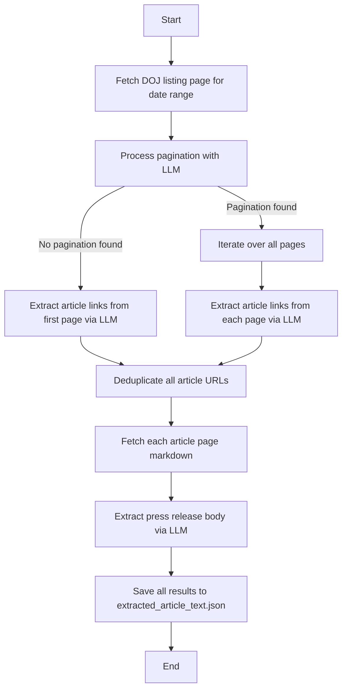

# 🏛️ DOJ_Scraper

**DOJ_Scraper** is a Python-based scraper for collecting press releases from the U.S. Department of Justice website.  
It automates:

- Fetching DOJ press release listings for a given date range  
- Detecting pagination (if present)  
- Extracting article links directly from the first page when no pagination exists  
- Fetching full article content via an LLM  
- Saving structured output in JSON format

---

## 🚀 Key Features

- **Pagination-aware** — Scrapes across all result pages when pagination exists  
- **Single-page safe** — If no pagination is found, extracts links directly from the initial listing page  
- **LLM-powered parsing** — Uses an OpenAI model to identify article links and extract clean article bodies from DOJ markdown pages  
- **Error-tolerant** — Logs failures per URL so no links vanish silently  
- **Structured output** — Stores results in a single JSON file for easy consumption

---

## 📦 Requirements

- Python **3.9+**  
- `OPENAI_API_KEY` set in your `.env` file  
- Install dependencies:
```bash
python3 -m venv .venv
source .venv/bin/activate
pip install -r requirements.txt
```

---

## ⚙️ Usage

From the project root:

```bash
source .venv/bin/activate

# Run with explicit date range
python main.py --start-date YYYY-MM-DD --end-date YYYY-MM-DD
```

Example:
```bash
python main.py --start-date 2025-08-05 --end-date 2025-08-06
```

The scraper will:

1. Fetch the DOJ press room listing for the given range  
2. Detect whether pagination exists  
3. If paginated — scrape all pages; if not — extract directly from the first page  
4. Visit each article and extract the press release text  
5. Save results to `extracted_article_text.json`

---

## 📊 Control Flow Diagram



---

## 🗂️ Output

- **File:** `extracted_article_text.json`  
- **Format:** `{ "article_url": "extracted text", ... }`  
- Failed extractions are stored with descriptive placeholders (`"Markdown fetch failed"`, `"Extraction failed"`, etc.)

---

## ✅ Tips

- Narrow date ranges may result in only a single page — the scraper now handles this automatically.  
- Wider date ranges will likely yield pagination, in which case all pages are scraped.  
- Respect DOJ’s terms of service and avoid overly aggressive scraping (a polite concurrency limit is built in).

---

## 🔧 Planned Enhancements

- Deterministic (non-LLM) link extraction to reduce API usage  
- Optional CSV/JSONL/SQLite outputs  
- Automatic retries with exponential backoff for failed pages

---

## 📄 License & Contributing

This project currently has **no license**.  
Feel free to fork, modify, or suggest features via pull requests or issues.
